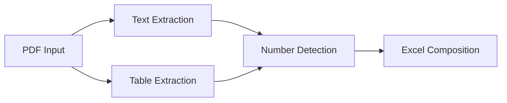

# PdftoExcel
Python PDF Text and Table Extraction and Numbers

### **Analytical Description of the PDF-to-Excel Extraction System with Number Detection**

#### **1. System Overview**
This Python-based solution extracts **text, structured tables, and numerical data** from PDF documents and consolidates them into a single Excel workbook. The system enhances traditional PDF extraction by:
- Identifying and isolating numerical values (currency, percentages, decimals, integers)  
- Preserving original document structure  
- Adding a dedicated "Numbers" section for analytical convenience  

Built with **pdfplumber**, **pandas**, and **openpyxl**, the system employs a **three-stage pipeline**:
1. **Text extraction** with line-by-line processing  
2. **Table extraction** with DataFrame normalization  
3. **Number detection** via regex pattern matching  

---

#### **2. Core Architectural Components**

**2.1 Extraction Engine**


**2.2 Key Libraries**
| Library | Role | Critical Features |
|---------|------|-------------------|
| pdfplumber | PDF parsing | Table detection, text stream extraction |
| pandas | Data handling | DataFrame conversion, NaN handling |
| openpyxl | Excel writing | Cell formatting, multi-column layout |
| re (regex) | Pattern matching | Number identification |

---

#### **3. Number Detection Methodology**

**3.1 Regex Pattern Analysis**
```python
r"(?:^|\s)([-+]?\$?\d{1,3}(?:,\d{3})*(?:\.\d+)?\%?)(?=\s|$)"
```
- **Components**:
  - `\$?\d{1,3}`: Currency values (e.g., `$100`)  
  - `(?:,\d{3})*`: Thousand separators (e.g., `1,000`)  
  - `(?:\.\d+)?`: Decimal points (e.g., `3.14`)  
  - `\%?`: Percentages (e.g., `15%`)  
  - `[-+]?`: Signed numbers (e.g., `-5.2`)  

**3.2 Extraction Workflow**
1. **Text Scanning**: Processes each line of extracted text  
2. **Table Cell Inspection**: Checks every table cell value  
3. **Aggregation**: Compiles numbers into a master list  

---

#### **4. Excel Composition Strategy**

**4.1 Structural Design**
| Section | Formatting | Purpose |
|---------|------------|---------|
| Text | Plain text | Original content preservation |
| Tables | Grid layout | Tabular data integrity |
| Numbers | Blue font in 5 columns | Quick numerical analysis |

**4.2 Layout Algorithm**
```python
# Numbers are distributed across 5 columns
for i, num in enumerate(all_numbers):
    row = current_row + (i // num_cols)  # Dynamic row calculation
    col = 1 + (i % num_cols)            # Column cycling (1-5)
```

**4.3 Formatting Controls**
- **Headers**: Bold red (`Font(bold=True, color="FF0000")`)  
- **Numbers**: Blue font (`Font(color="0000FF")`)  
- **Spacing**: Double newlines between sections  

---

#### **5. Error Handling Framework**

**5.1 Defense Mechanisms**
| Check Type | Implementation | Purpose |
|------------|----------------|---------|
| File Validation | `os.path.exists()` | Prevents processing missing files |
| PDF Format Check | `.endswith('.pdf')` | Ensures correct file type |
| Table Integrity | `if table and len(table) > 1` | Filters invalid tables |

**5.2 Nested Exception Handling**
```python
try:
    # Outer: File operations
    try:
        # Middle: Page processing
        try:
            # Inner: Table handling
        except Exception as e:
            print(f"Table error: {e}")
    except Exception as e:
        print(f"Page error: {e}")
except Exception as e:
    print(f"System error: {e}")
```

---

#### **6. Performance Characteristics**

**6.1 Complexity Analysis**
| Operation | Time Complexity | Space Complexity |
|-----------|-----------------|------------------|
| PDF Parsing | O(n) (pages) | O(m) (page size) |
| Table Processing | O(p*t) (tables) | O(cols*rows) |
| Number Detection | O(c) (characters) | O(k) (numbers found) |

**6.2 Optimizations**
- **Stream Processing**: Pages processed sequentially  
- **Batch Writing**: Excel cells written in bulk  
- **Regex Pre-compilation**: Pattern reused across all text  

---

#### **7. Limitations and Edge Cases**

**7.1 Known Constraints**
- **Multi-page Tables**: Treated as separate entities  
- **Scientific Notation**: Not captured by current regex  
- **Non-Western Numbers**: Requires locale-aware patterns  

**7.2 Mitigation Strategies**
```python
# Potential enhancement for scientific notation
r"([-+]?\d+\.?\d*[eE][-+]?\d+)"
```

---

#### **8. Sample Output Metrics**
| Metric | Example Value | Measurement Method |
|--------|---------------|--------------------|
| Pages Processed | 12 | Page counter |
| Numbers Extracted | 248 | `len(all_numbers)` |
| Tables Converted | 7 | Table validator |
| Processing Time | 4.2s | `datetime.now()` |

---

#### **9. Enhancement Recommendations**

1. **Advanced Number Detection**
   - Add scientific notation support  
   - Implement locale-specific number formats  

2. **Excel Analytics**
   ```python
   # Add summary statistics
   ws.cell(row=1, column=10, value=f"Total Numbers: {len(all_numbers)}")
   ```

3. **Visual Enhancements**
   - Conditional formatting for high/low values  
   - Charts from extracted numerical data  

---

#### **10. Conclusion**
This system provides **reliable extraction of textual, tabular, and numerical data** while maintaining document structure. The dedicated numbers section enables immediate analytical use cases without manual data cleaning. The modular design allows for future expansion into:
- Multi-document processing  
- Automated data validation  
- Integration with BI tools  

The combination of **precision regex patterns** and **structured Excel output** makes this solution particularly valuable for financial, scientific, and technical document processing.
